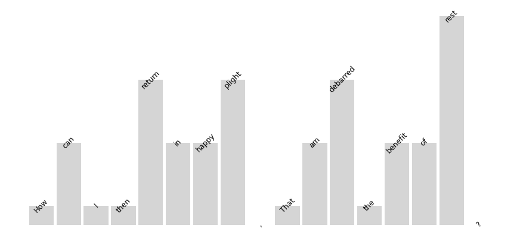

# Cadence

A rhythm analysis toolkit, gathering multiple parsing engines:
* ~~[Prosodic](https://github.com/quadrismegistus/prosodic) for fast English and Finnish metrical scansion.~~
  * Cadence now uses its own metrical parser, a rewritten version of Prosodic's.
* [MetricalTree](https://github.com/tdozat/Metrics) for syntactic parsing and phrasal stress assignment.

## Quickstart

### Install

#### 1. Install python package
```
# install from pypi
pip install -U cadences    # "cadence" was taken :-/

# or from github very latest
pip install -U git+https://github.com/quadrismegistus/cadence
```

#### 2. Insteall espeak (TTS)

Install espeak, free TTS software, to 'sound out' unknown words. See [here](http://espeak.sourceforge.net/download.html) for all downloads.

* On Linux, type into the terminal:
        ```apt-get install espeak```
    
* On Mac:
  * Install [homebrew](brew.sh) if not already installed.

  * Type into the Terminal app: `brew install espeak`
    
* On Windows:
        Download and install from http://espeak.sourceforge.net/download.html.

### Load cadence

```python
# this should work following installation
import cadence as cd
```

### Load texts

```python
# verse
sonnetXIV = """
How can I then return in happy plight,
That am debarred the benefit of rest?
When day’s oppression is not eased by night,
But day by night and night by day oppressed,
And each, though enemies to either’s reign,
Do in consent shake hands to torture me,
The one by toil, the other to complain
How far I toil, still farther off from thee.
I tell the day, to please him thou art bright,
And dost him grace when clouds do blot the heaven:
So flatter I the swart-complexiond night,
When sparkling stars twire not thou gildst the even.
But day doth daily draw my sorrows longer,
And night doth nightly make grief’s length seem stronger.
"""

# prose
melville="""Is it that by its indefiniteness it shadows forth the
heartless voids and immensities of the universe, and thus stabs us
from behind with the thought of annihilation, when beholding
the white depths of the milky way? Or is it, that as in
essence whiteness is not so much a colour as the visible absence
of colour; and at the same time the concrete of all colours;
is it for these reasons that there is such a dumb blankness,
full of meaning, in a wide landscape of snows: a colourless,
all-colour of atheism from which we shrink?"""
```


```python
# These are identical
sonnet = cd.Verse(sonnetXIV)
sonnet = cd.Text(sonnetXIV, linebreaks=True, phrasebreaks=False)

# So are these
prose = cd.Prose(melville)
prose = cd.Text(melville, linebreaks=False, phrasebreaks=True)
```

### Available features

```python
# Tokenize
sonnet.words()
```


<div>

<table border="1" class="dataframe">
  <thead>
    <tr style="text-align: right;">
      <th></th>
      <th></th>
      <th></th>
      <th></th>
      <th></th>
      <th></th>
      <th>word_ispunc</th>
    </tr>
    <tr>
      <th>para_i</th>
      <th>sent_i</th>
      <th>sentpart_i</th>
      <th>line_i</th>
      <th>word_i</th>
      <th>word_str</th>
      <th></th>
    </tr>
  </thead>
  <tbody>
    <tr>
      <th rowspan="11" valign="top">1</th>
      <th rowspan="5" valign="top">1</th>
      <th rowspan="5" valign="top">1</th>
      <th rowspan="5" valign="top">1</th>
      <th>1</th>
      <th>How</th>
      <td>0</td>
    </tr>
    <tr>
      <th>2</th>
      <th>can</th>
      <td>0</td>
    </tr>
    <tr>
      <th>3</th>
      <th>I</th>
      <td>0</td>
    </tr>
    <tr>
      <th>4</th>
      <th>then</th>
      <td>0</td>
    </tr>
    <tr>
      <th>5</th>
      <th>return</th>
      <td>0</td>
    </tr>
    <tr>
      <th>...</th>
      <th>...</th>
      <th>...</th>
      <th>...</th>
      <th>...</th>
      <td>...</td>
    </tr>
    <tr>
      <th rowspan="5" valign="top">4</th>
      <th rowspan="5" valign="top">17</th>
      <th rowspan="5" valign="top">14</th>
      <th>15</th>
      <th>grief's</th>
      <td>0</td>
    </tr>
    <tr>
      <th>16</th>
      <th>length</th>
      <td>0</td>
    </tr>
    <tr>
      <th>17</th>
      <th>seem</th>
      <td>0</td>
    </tr>
    <tr>
      <th>18</th>
      <th>stronger</th>
      <td>0</td>
    </tr>
    <tr>
      <th>19</th>
      <th>.</th>
      <td>1</td>
    </tr>
  </tbody>
</table>
<p>135 rows × 1 columns</p>
</div>


```python
# Syllabify
sonnet.sylls()
```


<div>

<table border="1" class="dataframe">
  <thead>
    <tr style="text-align: right;">
      <th></th>
      <th></th>
      <th></th>
      <th></th>
      <th></th>
      <th></th>
      <th></th>
      <th></th>
      <th></th>
      <th></th>
      <th></th>
      <th></th>
      <th></th>
      <th></th>
      <th>prom_strength</th>
      <th>prom_stress</th>
      <th>prom_weight</th>
      <th>word_isfunc</th>
      <th>word_ispunc</th>
      <th>word_nsyll</th>
    </tr>
    <tr>
      <th>para_i</th>
      <th>sent_i</th>
      <th>sentpart_i</th>
      <th>line_i</th>
      <th>word_i</th>
      <th>word_str</th>
      <th>word_tok</th>
      <th>word_ipa_i</th>
      <th>word_ipa</th>
      <th>syll_i</th>
      <th>syll_str</th>
      <th>syll_ipa</th>
      <th>syll_stress</th>
      <th>syll_weight</th>
      <th></th>
      <th></th>
      <th></th>
      <th></th>
      <th></th>
      <th></th>
    </tr>
  </thead>
  <tbody>
    <tr>
      <th rowspan="11" valign="top">1</th>
      <th rowspan="5" valign="top">1</th>
      <th rowspan="5" valign="top">1</th>
      <th rowspan="5" valign="top">1</th>
      <th>1</th>
      <th>How</th>
      <th>how</th>
      <th>1</th>
      <th>haʊ</th>
      <th>1</th>
      <th>How</th>
      <th>haʊ</th>
      <th>U</th>
      <th>H</th>
      <td>NaN</td>
      <td>0.0</td>
      <td>1.0</td>
      <td>1.0</td>
      <td>0</td>
      <td>1</td>
    </tr>
    <tr>
      <th>2</th>
      <th>can</th>
      <th>can</th>
      <th>1</th>
      <th>kæn</th>
      <th>1</th>
      <th>can</th>
      <th>kæn</th>
      <th>U</th>
      <th>H</th>
      <td>NaN</td>
      <td>0.0</td>
      <td>1.0</td>
      <td>1.0</td>
      <td>0</td>
      <td>1</td>
    </tr>
    <tr>
      <th rowspan="2" valign="top">3</th>
      <th rowspan="2" valign="top">I</th>
      <th rowspan="2" valign="top">i</th>
      <th>1</th>
      <th>'aɪ</th>
      <th>1</th>
      <th>I</th>
      <th>'aɪ</th>
      <th>P</th>
      <th>H</th>
      <td>1.0</td>
      <td>1.0</td>
      <td>1.0</td>
      <td>0.0</td>
      <td>0</td>
      <td>1</td>
    </tr>
    <tr>
      <th>2</th>
      <th>aɪ</th>
      <th>1</th>
      <th>I</th>
      <th>aɪ</th>
      <th>U</th>
      <th>H</th>
      <td>0.0</td>
      <td>0.0</td>
      <td>1.0</td>
      <td>1.0</td>
      <td>0</td>
      <td>1</td>
    </tr>
    <tr>
      <th>4</th>
      <th>then</th>
      <th>then</th>
      <th>1</th>
      <th>'ðɛn</th>
      <th>1</th>
      <th>then</th>
      <th>'ðɛn</th>
      <th>P</th>
      <th>H</th>
      <td>1.0</td>
      <td>1.0</td>
      <td>1.0</td>
      <td>0.0</td>
      <td>0</td>
      <td>1</td>
    </tr>
    <tr>
      <th>...</th>
      <th>...</th>
      <th>...</th>
      <th>...</th>
      <th>...</th>
      <th>...</th>
      <th>...</th>
      <th>...</th>
      <th>...</th>
      <th>...</th>
      <th>...</th>
      <th>...</th>
      <th>...</th>
      <td>...</td>
      <td>...</td>
      <td>...</td>
      <td>...</td>
      <td>...</td>
      <td>...</td>
    </tr>
    <tr>
      <th rowspan="5" valign="top">4</th>
      <th rowspan="5" valign="top">17</th>
      <th rowspan="5" valign="top">14</th>
      <th>16</th>
      <th>length</th>
      <th>length</th>
      <th>1</th>
      <th>'lɛŋkθ</th>
      <th>1</th>
      <th>length</th>
      <th>'lɛŋkθ</th>
      <th>P</th>
      <th>H</th>
      <td>NaN</td>
      <td>1.0</td>
      <td>1.0</td>
      <td>0.0</td>
      <td>0</td>
      <td>1</td>
    </tr>
    <tr>
      <th>17</th>
      <th>seem</th>
      <th>seem</th>
      <th>1</th>
      <th>'siːm</th>
      <th>1</th>
      <th>seem</th>
      <th>'siːm</th>
      <th>P</th>
      <th>H</th>
      <td>NaN</td>
      <td>1.0</td>
      <td>1.0</td>
      <td>0.0</td>
      <td>0</td>
      <td>1</td>
    </tr>
    <tr>
      <th rowspan="2" valign="top">18</th>
      <th rowspan="2" valign="top">stronger</th>
      <th rowspan="2" valign="top">stronger</th>
      <th rowspan="2" valign="top">1</th>
      <th rowspan="2" valign="top">'strɔːŋ.ɛː</th>
      <th>1</th>
      <th>stron</th>
      <th>'strɔːŋ</th>
      <th>P</th>
      <th>H</th>
      <td>1.0</td>
      <td>1.0</td>
      <td>1.0</td>
      <td>0.0</td>
      <td>0</td>
      <td>2</td>
    </tr>
    <tr>
      <th>2</th>
      <th>ger</th>
      <th>ɛː</th>
      <th>U</th>
      <th>L</th>
      <td>0.0</td>
      <td>0.0</td>
      <td>0.0</td>
      <td>0.0</td>
      <td>0</td>
      <td>2</td>
    </tr>
    <tr>
      <th>19</th>
      <th>.</th>
      <th></th>
      <th>0</th>
      <th></th>
      <th>0</th>
      <th>.</th>
      <th></th>
      <th>NaN</th>
      <th>NaN</th>
      <td>NaN</td>
      <td>NaN</td>
      <td>NaN</td>
      <td>NaN</td>
      <td>1</td>
      <td>0</td>
    </tr>
  </tbody>
</table>
<p>186 rows × 6 columns</p>
</div>


```python
# Syntax-parse
sonnet.syntax()
```


<div>

<table border="1" class="dataframe">
  <thead>
    <tr style="text-align: right;">
      <th></th>
      <th></th>
      <th></th>
      <th></th>
      <th>dep_head</th>
      <th>dep_type</th>
      <th>pos_case</th>
      <th>pos_definite</th>
      <th>pos_degree</th>
      <th>pos_gender</th>
      <th>pos_mood</th>
      <th>pos_number</th>
      <th>pos_person</th>
      <th>pos_polarity</th>
      <th>pos_poss</th>
      <th>pos_prontype</th>
      <th>pos_tense</th>
      <th>pos_upos</th>
      <th>pos_verbform</th>
      <th>pos_voice</th>
      <th>pos_xpos</th>
      <th>word_depth</th>
    </tr>
    <tr>
      <th>para_i</th>
      <th>sent_i</th>
      <th>word_i</th>
      <th>word_str</th>
      <th></th>
      <th></th>
      <th></th>
      <th></th>
      <th></th>
      <th></th>
      <th></th>
      <th></th>
      <th></th>
      <th></th>
      <th></th>
      <th></th>
      <th></th>
      <th></th>
      <th></th>
      <th></th>
      <th></th>
      <th></th>
    </tr>
  </thead>
  <tbody>
    <tr>
      <th rowspan="11" valign="top">1</th>
      <th rowspan="5" valign="top">1</th>
      <th>1</th>
      <th>How</th>
      <td>5</td>
      <td>advmod</td>
      <td></td>
      <td></td>
      <td></td>
      <td></td>
      <td></td>
      <td></td>
      <td></td>
      <td></td>
      <td></td>
      <td>Int</td>
      <td></td>
      <td>ADV</td>
      <td></td>
      <td></td>
      <td>WRB</td>
      <td>4</td>
    </tr>
    <tr>
      <th>2</th>
      <th>can</th>
      <td>5</td>
      <td>aux</td>
      <td></td>
      <td></td>
      <td></td>
      <td></td>
      <td></td>
      <td></td>
      <td></td>
      <td></td>
      <td></td>
      <td></td>
      <td></td>
      <td>AUX</td>
      <td>Fin</td>
      <td></td>
      <td>MD</td>
      <td>4</td>
    </tr>
    <tr>
      <th>3</th>
      <th>I</th>
      <td>5</td>
      <td>nsubj</td>
      <td>Nom</td>
      <td></td>
      <td></td>
      <td></td>
      <td></td>
      <td>Sing</td>
      <td>1</td>
      <td></td>
      <td></td>
      <td>Prs</td>
      <td></td>
      <td>PRON</td>
      <td></td>
      <td></td>
      <td>PRP</td>
      <td>5</td>
    </tr>
    <tr>
      <th>4</th>
      <th>then</th>
      <td>5</td>
      <td>advmod</td>
      <td></td>
      <td></td>
      <td></td>
      <td></td>
      <td></td>
      <td></td>
      <td></td>
      <td></td>
      <td></td>
      <td>Dem</td>
      <td></td>
      <td>ADV</td>
      <td></td>
      <td></td>
      <td>RB</td>
      <td>5</td>
    </tr>
    <tr>
      <th>5</th>
      <th>return</th>
      <td>0</td>
      <td>root</td>
      <td></td>
      <td></td>
      <td></td>
      <td></td>
      <td></td>
      <td></td>
      <td></td>
      <td></td>
      <td></td>
      <td></td>
      <td></td>
      <td>VERB</td>
      <td>Inf</td>
      <td></td>
      <td>VB</td>
      <td>5</td>
    </tr>
    <tr>
      <th>...</th>
      <th>...</th>
      <th>...</th>
      <td>...</td>
      <td>...</td>
      <td>...</td>
      <td>...</td>
      <td>...</td>
      <td>...</td>
      <td>...</td>
      <td>...</td>
      <td>...</td>
      <td>...</td>
      <td>...</td>
      <td>...</td>
      <td>...</td>
      <td>...</td>
      <td>...</td>
      <td>...</td>
      <td>...</td>
      <td>...</td>
    </tr>
    <tr>
      <th rowspan="5" valign="top">4</th>
      <th>15</th>
      <th>grief's</th>
      <td>16</td>
      <td>compound</td>
      <td></td>
      <td></td>
      <td></td>
      <td></td>
      <td></td>
      <td>Plur</td>
      <td></td>
      <td></td>
      <td></td>
      <td></td>
      <td></td>
      <td>NOUN</td>
      <td></td>
      <td></td>
      <td>NNS</td>
      <td>8</td>
    </tr>
    <tr>
      <th>16</th>
      <th>length</th>
      <td>14</td>
      <td>obj</td>
      <td></td>
      <td></td>
      <td></td>
      <td></td>
      <td></td>
      <td>Sing</td>
      <td></td>
      <td></td>
      <td></td>
      <td></td>
      <td></td>
      <td>NOUN</td>
      <td></td>
      <td></td>
      <td>NN</td>
      <td>8</td>
    </tr>
    <tr>
      <th>17</th>
      <th>seem</th>
      <td>14</td>
      <td>xcomp</td>
      <td></td>
      <td></td>
      <td></td>
      <td></td>
      <td></td>
      <td></td>
      <td></td>
      <td></td>
      <td></td>
      <td></td>
      <td></td>
      <td>VERB</td>
      <td>Inf</td>
      <td></td>
      <td>VB</td>
      <td>10</td>
    </tr>
    <tr>
      <th>18</th>
      <th>stronger</th>
      <td>17</td>
      <td>xcomp</td>
      <td></td>
      <td></td>
      <td>Cmp</td>
      <td></td>
      <td></td>
      <td></td>
      <td></td>
      <td></td>
      <td></td>
      <td></td>
      <td></td>
      <td>ADJ</td>
      <td></td>
      <td></td>
      <td>JJR</td>
      <td>12</td>
    </tr>
    <tr>
      <th>19</th>
      <th>.</th>
      <td>5</td>
      <td>punct</td>
      <td></td>
      <td></td>
      <td></td>
      <td></td>
      <td></td>
      <td></td>
      <td></td>
      <td></td>
      <td></td>
      <td></td>
      <td></td>
      <td>PUNCT</td>
      <td></td>
      <td></td>
      <td>.</td>
      <td>3</td>
    </tr>
  </tbody>
</table>
<p>135 rows × 18 columns</p>
</div>


### Sentence-level information from MetricalTree


```python
# Show sentences
sentence = sonnet.sent(1)
sentence.mtree()
```


    
```python
# Show sentence tree for prose
prose.sent(1).mtree()
```

    

    


```python
# Stress grid of sentence inferred from syntactic tree
sentence.grid()
```


    

    

### Metrical parsing

```python
# Parse lines (verse)
sonnet.parse()
```


 How can <u><b>I</b></u> <u><b>then</b></u> re<u><b>turn</b></u> in <u><b>hap</b></u>py <u><b>plight</b></u>,


 That <u>am</u> de<u><b>barred</b></u> the <u><b>be</b></u>ne<u>fit</u> of <u><b>rest</b></u>?


 When <u><b>day's</b></u> op<u><b>pres</b></u>sion <u><b>is</b></u> not <u><b>eased</b></u> by <u><b>night</b></u>,


 But <u><b>day</b></u> by <u><b>night</b></u> and <u><b>night</b></u> by <u><b>day</b></u> op<u><b>pressed</b></u>,


 And <u><b>each</b></u>, though <u><b>e</b></u>ne<u>mies</u> to <u><b>eit</b></u>her's <u><b>reign</b></u>,


 Do <u><b>in</b></u> con<u><b>sent</b></u> <b>shake</b> <u><b>hands</b></u> to <u><b>tor</b></u>ture <u>me</u>,


 The <u>one</u> by <u><b>toil</b></u>, the <u><b>ot</b></u>her <u>to</u> com<u><b>plain</b></u>


 How <u><b>far</b></u> I <u><b>toil</b></u>, <b>still</b> <u><b>fart</b></u>her <u>off</u> from thee.


 I <u><b>tell</b></u> the <u><b>day</b></u>, to <u><b>please</b></u> him thou <u><b>art</b></u> <b>bright</b>,


 And <u><b>dost</b></u> him <u><b>grace</b></u> when <u><b>clouds</b></u> do <u><b>blot</b></u> the <u><b>heaven</b></u>:


 So <u><b>flat</b></u>ter <u><b>I</b></u> the <u><b>swart</b></u>- com<u><b>ple</b></u>xiond <u><b>night</b></u>,


 When <u><b>spar</b></u>kling <u><b>stars</b></u> <u><b>twi</b></u>re <u><b>not</b></u> thou <u><b>gildst</b></u> the <u><b>e</b></u>ven.


 But <u><b>day</b></u> doth <u><b>dai</b></u>ly <u><b>draw</b></u> my <u><b>sor</b></u>rows <u><b>lon</b></u>ger,


 And <u><b>night</b></u> doth <u><b>nigh</b></u>tly <u><b>make</b></u> <b>grief's</b> <u><b>length</b></u> <b>seem</b> <u><b>stron</b></u>ger.


<div>

<table border="1" class="dataframe">
  <thead>
    <tr style="text-align: right;">
      <th></th>
      <th></th>
      <th></th>
      <th></th>
      <th></th>
      <th></th>
      <th></th>
      <th></th>
      <th></th>
      <th></th>
      <th></th>
      <th></th>
      <th></th>
      <th></th>
      <th></th>
      <th></th>
      <th></th>
      <th></th>
      <th></th>
      <th></th>
      <th></th>
      <th></th>
      <th></th>
      <th></th>
      <th>*total</th>
      <th>*s_unstressed</th>
      <th>*unres_across</th>
      <th>*unres_within</th>
      <th>*w_peak</th>
      <th>*w_stressed</th>
      <th>dep_head</th>
      <th>dep_type</th>
      <th>mtree_ishead</th>
      <th>num_parses</th>
      <th>pos_case</th>
      <th>pos_definite</th>
      <th>pos_degree</th>
      <th>pos_gender</th>
      <th>pos_mood</th>
      <th>pos_number</th>
      <th>pos_person</th>
      <th>pos_polarity</th>
      <th>pos_poss</th>
      <th>pos_prontype</th>
      <th>pos_tense</th>
      <th>pos_upos</th>
      <th>pos_verbform</th>
      <th>pos_voice</th>
      <th>pos_xpos</th>
      <th>prom_lstress</th>
      <th>prom_pstrength</th>
      <th>prom_pstress</th>
      <th>prom_strength</th>
      <th>prom_stress</th>
      <th>prom_tstress</th>
      <th>prom_weight</th>
      <th>word_depth</th>
      <th>word_isfunc</th>
      <th>word_ispunc</th>
      <th>word_nsyll</th>
    </tr>
    <tr>
      <th>para_i</th>
      <th>unit_i</th>
      <th>parse_rank</th>
      <th>is_troch</th>
      <th>parse_i</th>
      <th>parse</th>
      <th>parse_str</th>
      <th>sent_i</th>
      <th>sentpart_i</th>
      <th>line_i</th>
      <th>combo_i</th>
      <th>slot_i</th>
      <th>slot_meter</th>
      <th>syll_str_parse</th>
      <th>word_i</th>
      <th>word_str</th>
      <th>word_tok</th>
      <th>word_ipa_i</th>
      <th>word_ipa</th>
      <th>syll_i</th>
      <th>syll_str</th>
      <th>syll_ipa</th>
      <th>syll_stress</th>
      <th>syll_weight</th>
      <th></th>
      <th></th>
      <th></th>
      <th></th>
      <th></th>
      <th></th>
      <th></th>
      <th></th>
      <th></th>
      <th></th>
      <th></th>
      <th></th>
      <th></th>
      <th></th>
      <th></th>
      <th></th>
      <th></th>
      <th></th>
      <th></th>
      <th></th>
      <th></th>
      <th></th>
      <th></th>
      <th></th>
      <th></th>
      <th></th>
      <th></th>
      <th></th>
      <th></th>
      <th></th>
      <th></th>
      <th></th>
      <th></th>
      <th></th>
      <th></th>
      <th></th>
    </tr>
  </thead>
  <tbody>
    <tr>
      <th rowspan="11" valign="top">1</th>
      <th rowspan="5" valign="top">1</th>
      <th rowspan="5" valign="top">1</th>
      <th rowspan="5" valign="top">0</th>
      <th rowspan="5" valign="top">1</th>
      <th rowspan="5" valign="top">wwSSwSwSwS</th>
      <th rowspan="5" valign="top">𝖧𝗈𝗐 𝖼𝖺𝗇 𝗜 𝙩𝙝𝙚𝙣 𝗋𝖾𝘁𝘂𝗿𝗻 𝗂𝗇 𝗵𝗮𝗽𝗉𝗒 𝗽𝗹𝗶𝗴𝗵𝘁,</th>
      <th rowspan="5" valign="top">1</th>
      <th rowspan="5" valign="top">1</th>
      <th rowspan="5" valign="top">1</th>
      <th rowspan="5" valign="top">1</th>
      <th>1</th>
      <th>w</th>
      <th>𝖧𝗈𝗐</th>
      <th>1</th>
      <th>How</th>
      <th>how</th>
      <th>1</th>
      <th>haʊ</th>
      <th>1</th>
      <th>How</th>
      <th>haʊ</th>
      <th>U</th>
      <th>H</th>
      <td>0.0</td>
      <td>0.0</td>
      <td>0.0</td>
      <td>0.0</td>
      <td>0.0</td>
      <td>0.0</td>
      <td>5</td>
      <td>advmod</td>
      <td>NaN</td>
      <td>4</td>
      <td></td>
      <td></td>
      <td></td>
      <td></td>
      <td></td>
      <td></td>
      <td></td>
      <td></td>
      <td></td>
      <td>Int</td>
      <td></td>
      <td>ADV</td>
      <td></td>
      <td></td>
      <td>WRB</td>
      <td>0.0</td>
      <td>NaN</td>
      <td>0.0</td>
      <td>NaN</td>
      <td>0.0</td>
      <td>0.000000</td>
      <td>1.0</td>
      <td>4</td>
      <td>1.0</td>
      <td>0</td>
      <td>1</td>
    </tr>
    <tr>
      <th>2</th>
      <th>w</th>
      <th>𝖼𝖺𝗇</th>
      <th>2</th>
      <th>can</th>
      <th>can</th>
      <th>1</th>
      <th>kæn</th>
      <th>1</th>
      <th>can</th>
      <th>kæn</th>
      <th>U</th>
      <th>H</th>
      <td>0.0</td>
      <td>0.0</td>
      <td>0.0</td>
      <td>0.0</td>
      <td>0.0</td>
      <td>0.0</td>
      <td>5</td>
      <td>aux</td>
      <td>NaN</td>
      <td>4</td>
      <td></td>
      <td></td>
      <td></td>
      <td></td>
      <td></td>
      <td></td>
      <td></td>
      <td></td>
      <td></td>
      <td></td>
      <td></td>
      <td>AUX</td>
      <td>Fin</td>
      <td></td>
      <td>MD</td>
      <td>0.0</td>
      <td>NaN</td>
      <td>0.0</td>
      <td>NaN</td>
      <td>0.0</td>
      <td>0.333333</td>
      <td>1.0</td>
      <td>4</td>
      <td>1.0</td>
      <td>0</td>
      <td>1</td>
    </tr>
    <tr>
      <th>3</th>
      <th>s</th>
      <th>𝗜</th>
      <th>3</th>
      <th>I</th>
      <th>i</th>
      <th>1</th>
      <th>'aɪ</th>
      <th>1</th>
      <th>I</th>
      <th>'aɪ</th>
      <th>P</th>
      <th>H</th>
      <td>0.0</td>
      <td>0.0</td>
      <td>0.0</td>
      <td>0.0</td>
      <td>0.0</td>
      <td>0.0</td>
      <td>5</td>
      <td>nsubj</td>
      <td>NaN</td>
      <td>4</td>
      <td>Nom</td>
      <td></td>
      <td></td>
      <td></td>
      <td></td>
      <td>Sing</td>
      <td>1</td>
      <td></td>
      <td></td>
      <td>Prs</td>
      <td></td>
      <td>PRON</td>
      <td></td>
      <td></td>
      <td>PRP</td>
      <td>0.0</td>
      <td>NaN</td>
      <td>0.0</td>
      <td>1.0</td>
      <td>1.0</td>
      <td>0.000000</td>
      <td>1.0</td>
      <td>5</td>
      <td>0.0</td>
      <td>0</td>
      <td>1</td>
    </tr>
    <tr>
      <th>4</th>
      <th>s</th>
      <th>𝙩𝙝𝙚𝙣</th>
      <th>4</th>
      <th>then</th>
      <th>then</th>
      <th>1</th>
      <th>'ðɛn</th>
      <th>1</th>
      <th>then</th>
      <th>'ðɛn</th>
      <th>P</th>
      <th>H</th>
      <td>1.0</td>
      <td>0.0</td>
      <td>1.0</td>
      <td>0.0</td>
      <td>0.0</td>
      <td>0.0</td>
      <td>5</td>
      <td>advmod</td>
      <td>NaN</td>
      <td>4</td>
      <td></td>
      <td></td>
      <td></td>
      <td></td>
      <td></td>
      <td></td>
      <td></td>
      <td></td>
      <td></td>
      <td>Dem</td>
      <td></td>
      <td>ADV</td>
      <td></td>
      <td></td>
      <td>RB</td>
      <td>0.0</td>
      <td>NaN</td>
      <td>0.0</td>
      <td>1.0</td>
      <td>1.0</td>
      <td>0.000000</td>
      <td>1.0</td>
      <td>5</td>
      <td>0.0</td>
      <td>0</td>
      <td>1</td>
    </tr>
    <tr>
      <th>5</th>
      <th>w</th>
      <th>𝗋𝖾</th>
      <th>5</th>
      <th>return</th>
      <th>return</th>
      <th>1</th>
      <th>rɪ.'tɛːn</th>
      <th>1</th>
      <th>re</th>
      <th>rɪ</th>
      <th>U</th>
      <th>L</th>
      <td>0.0</td>
      <td>0.0</td>
      <td>0.0</td>
      <td>0.0</td>
      <td>0.0</td>
      <td>0.0</td>
      <td>0</td>
      <td>root</td>
      <td>NaN</td>
      <td>4</td>
      <td></td>
      <td></td>
      <td></td>
      <td></td>
      <td></td>
      <td></td>
      <td></td>
      <td></td>
      <td></td>
      <td></td>
      <td></td>
      <td>VERB</td>
      <td>Inf</td>
      <td></td>
      <td>VB</td>
      <td>NaN</td>
      <td>NaN</td>
      <td>NaN</td>
      <td>0.0</td>
      <td>0.0</td>
      <td>NaN</td>
      <td>0.0</td>
      <td>5</td>
      <td>0.0</td>
      <td>0</td>
      <td>2</td>
    </tr>
    <tr>
      <th>...</th>
      <th>...</th>
      <th>...</th>
      <th>...</th>
      <th>...</th>
      <th>...</th>
      <th>...</th>
      <th>...</th>
      <th>...</th>
      <th>...</th>
      <th>...</th>
      <th>...</th>
      <th>...</th>
      <th>...</th>
      <th>...</th>
      <th>...</th>
      <th>...</th>
      <th>...</th>
      <th>...</th>
      <th>...</th>
      <th>...</th>
      <th>...</th>
      <th>...</th>
      <td>...</td>
      <td>...</td>
      <td>...</td>
      <td>...</td>
      <td>...</td>
      <td>...</td>
      <td>...</td>
      <td>...</td>
      <td>...</td>
      <td>...</td>
      <td>...</td>
      <td>...</td>
      <td>...</td>
      <td>...</td>
      <td>...</td>
      <td>...</td>
      <td>...</td>
      <td>...</td>
      <td>...</td>
      <td>...</td>
      <td>...</td>
      <td>...</td>
      <td>...</td>
      <td>...</td>
      <td>...</td>
      <td>...</td>
      <td>...</td>
      <td>...</td>
      <td>...</td>
      <td>...</td>
      <td>...</td>
      <td>...</td>
      <td>...</td>
      <td>...</td>
      <td>...</td>
      <td>...</td>
    </tr>
    <tr>
      <th rowspan="5" valign="top">14</th>
      <th rowspan="5" valign="top">2</th>
      <th rowspan="5" valign="top">0</th>
      <th rowspan="5" valign="top">1</th>
      <th rowspan="5" valign="top">wSwSwSSwSSw</th>
      <th rowspan="5" valign="top">𝖠𝗇𝖽 𝗻𝗶𝗴𝗵𝘁 𝖽𝗈𝗍𝗁 𝗻𝗶𝗴𝗵𝗍𝗅𝗒 𝗺𝗮𝗸𝗲 𝙜𝙧𝙞𝙚𝙛'𝙨 𝘭𝘦𝘯𝘨𝘵𝘩 𝘀𝗲𝗲𝗺 𝙨𝙩𝙧𝙤𝙣𝗀𝖾𝗋.</th>
      <th rowspan="5" valign="top">4</th>
      <th rowspan="5" valign="top">17</th>
      <th rowspan="5" valign="top">14</th>
      <th rowspan="5" valign="top">1</th>
      <th>8</th>
      <th>w</th>
      <th>𝘭𝘦𝘯𝘨𝘵𝘩</th>
      <th>16</th>
      <th>length</th>
      <th>length</th>
      <th>1</th>
      <th>'lɛŋkθ</th>
      <th>1</th>
      <th>length</th>
      <th>'lɛŋkθ</th>
      <th>P</th>
      <th>H</th>
      <td>1.0</td>
      <td>0.0</td>
      <td>0.0</td>
      <td>0.0</td>
      <td>0.0</td>
      <td>1.0</td>
      <td>14</td>
      <td>obj</td>
      <td>NaN</td>
      <td>2</td>
      <td></td>
      <td></td>
      <td></td>
      <td></td>
      <td></td>
      <td>Sing</td>
      <td></td>
      <td></td>
      <td></td>
      <td></td>
      <td></td>
      <td>NOUN</td>
      <td></td>
      <td></td>
      <td>NN</td>
      <td>1.0</td>
      <td>0.0</td>
      <td>0.0</td>
      <td>NaN</td>
      <td>1.0</td>
      <td>0.750000</td>
      <td>1.0</td>
      <td>8</td>
      <td>0.0</td>
      <td>0</td>
      <td>1</td>
    </tr>
    <tr>
      <th>9</th>
      <th>s</th>
      <th>𝘀𝗲𝗲𝗺</th>
      <th>17</th>
      <th>seem</th>
      <th>seem</th>
      <th>1</th>
      <th>'siːm</th>
      <th>1</th>
      <th>seem</th>
      <th>'siːm</th>
      <th>P</th>
      <th>H</th>
      <td>0.0</td>
      <td>0.0</td>
      <td>0.0</td>
      <td>0.0</td>
      <td>0.0</td>
      <td>0.0</td>
      <td>14</td>
      <td>xcomp</td>
      <td>NaN</td>
      <td>2</td>
      <td></td>
      <td></td>
      <td></td>
      <td></td>
      <td></td>
      <td></td>
      <td></td>
      <td></td>
      <td></td>
      <td></td>
      <td></td>
      <td>VERB</td>
      <td>Inf</td>
      <td></td>
      <td>VB</td>
      <td>1.0</td>
      <td>0.0</td>
      <td>0.0</td>
      <td>NaN</td>
      <td>1.0</td>
      <td>0.750000</td>
      <td>1.0</td>
      <td>10</td>
      <td>0.0</td>
      <td>0</td>
      <td>1</td>
    </tr>
    <tr>
      <th>10</th>
      <th>s</th>
      <th>𝙨𝙩𝙧𝙤𝙣</th>
      <th>18</th>
      <th>stronger</th>
      <th>stronger</th>
      <th>1</th>
      <th>'strɔːŋ.ɛː</th>
      <th>1</th>
      <th>stron</th>
      <th>'strɔːŋ</th>
      <th>P</th>
      <th>H</th>
      <td>1.0</td>
      <td>0.0</td>
      <td>1.0</td>
      <td>0.0</td>
      <td>0.0</td>
      <td>0.0</td>
      <td>17</td>
      <td>xcomp</td>
      <td>NaN</td>
      <td>2</td>
      <td></td>
      <td></td>
      <td>Cmp</td>
      <td></td>
      <td></td>
      <td></td>
      <td></td>
      <td></td>
      <td></td>
      <td></td>
      <td></td>
      <td>ADJ</td>
      <td></td>
      <td></td>
      <td>JJR</td>
      <td>1.0</td>
      <td>1.0</td>
      <td>1.0</td>
      <td>1.0</td>
      <td>1.0</td>
      <td>1.000000</td>
      <td>1.0</td>
      <td>12</td>
      <td>0.0</td>
      <td>0</td>
      <td>2</td>
    </tr>
    <tr>
      <th>11</th>
      <th>w</th>
      <th>𝗀𝖾𝗋</th>
      <th>18</th>
      <th>stronger</th>
      <th>stronger</th>
      <th>1</th>
      <th>'strɔːŋ.ɛː</th>
      <th>2</th>
      <th>ger</th>
      <th>ɛː</th>
      <th>U</th>
      <th>L</th>
      <td>0.0</td>
      <td>0.0</td>
      <td>0.0</td>
      <td>0.0</td>
      <td>0.0</td>
      <td>0.0</td>
      <td>17</td>
      <td>xcomp</td>
      <td>NaN</td>
      <td>2</td>
      <td></td>
      <td></td>
      <td>Cmp</td>
      <td></td>
      <td></td>
      <td></td>
      <td></td>
      <td></td>
      <td></td>
      <td></td>
      <td></td>
      <td>ADJ</td>
      <td></td>
      <td></td>
      <td>JJR</td>
      <td>NaN</td>
      <td>NaN</td>
      <td>NaN</td>
      <td>0.0</td>
      <td>0.0</td>
      <td>NaN</td>
      <td>0.0</td>
      <td>12</td>
      <td>0.0</td>
      <td>0</td>
      <td>2</td>
    </tr>
    <tr>
      <th>12</th>
      <th>NaN</th>
      <th>.</th>
      <th>19</th>
      <th>.</th>
      <th></th>
      <th>0</th>
      <th></th>
      <th>0</th>
      <th>.</th>
      <th></th>
      <th>NaN</th>
      <th>NaN</th>
      <td>0.0</td>
      <td>NaN</td>
      <td>NaN</td>
      <td>NaN</td>
      <td>NaN</td>
      <td>NaN</td>
      <td>5</td>
      <td>punct</td>
      <td>NaN</td>
      <td>2</td>
      <td></td>
      <td></td>
      <td></td>
      <td></td>
      <td></td>
      <td></td>
      <td></td>
      <td></td>
      <td></td>
      <td></td>
      <td></td>
      <td>PUNCT</td>
      <td></td>
      <td></td>
      <td>.</td>
      <td>NaN</td>
      <td>NaN</td>
      <td>NaN</td>
      <td>NaN</td>
      <td>NaN</td>
      <td>NaN</td>
      <td>NaN</td>
      <td>3</td>
      <td>NaN</td>
      <td>1</td>
      <td>0</td>
    </tr>
  </tbody>
</table>
<p>303 rows × 36 columns</p>
</div>


```python
# Parse prose
prose.parse()
```


 Is <u><b>it</b></u> that by <u>its</u> in<u><b>de</b></u>fi<u>ni</u>teness it <u><b>sha</b></u><u><b>dows</b></u> <b>forth</b>


 the <u><b>hear</b></u>tless <u><b>voids</b></u> and im<u><b>men</b></u>si<u>ties</u> of the <u><b>u</b></u>ni<u><b>verse</b></u>,


 and <u><b>thus</b></u>


 <u><b>stabs</b></u> us <u>from</u> be<u><b>hind</b></u> with the <u><b>thought</b></u> of an<u><b>ni</b></u>hi<u><b>la</b></u>tion,


 <u><b>when</b></u> be<u><b>hol</b></u>ding the <u><b>white</b></u> <u><b>depths</b></u> of the <u><b>mil</b></u>ky <u><b>way</b></u>?


 Or <u><b>is</b></u> it,


 <u><b>that</b></u> as in <u><b>es</b></u>sence <u><b>whi</b></u>teness <u><b>is</b></u> not so


 much a <u><b>co</b></u>lour <u>as</u> the <u><b>vi</b></u>sible <u><b>a</b></u>bsence of <u><b>co</b></u>lour;


 and <u><b>at</b></u> the <u><b>same</b></u> <u><b>time</b></u> the <u><b>con</b></u>crete <u>of</u> all <u><b>co</b></u>lours;


 is <u><b>it</b></u> for these <u><b>rea</b></u>sons <u><b>that</b></u> there <u><b>is</b></u> such a <u><b>dumb</b></u> <u><b>blan</b></u>kness,


 <u><b>full</b></u> of <u><b>mea</b></u>ning,


 in a <u><b>wide</b></u> <b>lands</b><u><b>cape</b></u> of <u><b>snows</b></u>:


 a <u><b>co</b></u>lourless,


 all- <u><b>co</b></u>lour <u>of</u> at<u><b>he</b></u>ism from <u><b>which</b></u> we <u><b>shrink</b></u>?


<div>

<table border="1" class="dataframe">
  <thead>
    <tr style="text-align: right;">
      <th></th>
      <th></th>
      <th></th>
      <th></th>
      <th></th>
      <th></th>
      <th></th>
      <th></th>
      <th></th>
      <th></th>
      <th></th>
      <th></th>
      <th></th>
      <th></th>
      <th></th>
      <th></th>
      <th></th>
      <th></th>
      <th></th>
      <th></th>
      <th></th>
      <th></th>
      <th></th>
      <th></th>
      <th>*total</th>
      <th>*s_unstressed</th>
      <th>*unres_across</th>
      <th>*unres_within</th>
      <th>*w_peak</th>
      <th>*w_stressed</th>
      <th>dep_head</th>
      <th>dep_type</th>
      <th>mtree_ishead</th>
      <th>num_parses</th>
      <th>pos_case</th>
      <th>pos_definite</th>
      <th>pos_degree</th>
      <th>pos_gender</th>
      <th>pos_mood</th>
      <th>pos_number</th>
      <th>pos_person</th>
      <th>pos_polarity</th>
      <th>pos_poss</th>
      <th>pos_prontype</th>
      <th>pos_tense</th>
      <th>pos_upos</th>
      <th>pos_verbform</th>
      <th>pos_xpos</th>
      <th>prom_lstress</th>
      <th>prom_pstrength</th>
      <th>prom_pstress</th>
      <th>prom_strength</th>
      <th>prom_stress</th>
      <th>prom_tstress</th>
      <th>prom_weight</th>
      <th>word_depth</th>
      <th>word_isfunc</th>
      <th>word_ispunc</th>
      <th>word_nsyll</th>
    </tr>
    <tr>
      <th>para_i</th>
      <th>unit_i</th>
      <th>parse_rank</th>
      <th>is_troch</th>
      <th>parse_i</th>
      <th>parse</th>
      <th>parse_str</th>
      <th>sent_i</th>
      <th>sentpart_i</th>
      <th>line_i</th>
      <th>combo_i</th>
      <th>slot_i</th>
      <th>slot_meter</th>
      <th>syll_str_parse</th>
      <th>word_i</th>
      <th>word_str</th>
      <th>word_tok</th>
      <th>word_ipa_i</th>
      <th>word_ipa</th>
      <th>syll_i</th>
      <th>syll_str</th>
      <th>syll_ipa</th>
      <th>syll_stress</th>
      <th>syll_weight</th>
      <th></th>
      <th></th>
      <th></th>
      <th></th>
      <th></th>
      <th></th>
      <th></th>
      <th></th>
      <th></th>
      <th></th>
      <th></th>
      <th></th>
      <th></th>
      <th></th>
      <th></th>
      <th></th>
      <th></th>
      <th></th>
      <th></th>
      <th></th>
      <th></th>
      <th></th>
      <th></th>
      <th></th>
      <th></th>
      <th></th>
      <th></th>
      <th></th>
      <th></th>
      <th></th>
      <th></th>
      <th></th>
      <th></th>
      <th></th>
      <th></th>
    </tr>
  </thead>
  <tbody>
    <tr>
      <th rowspan="11" valign="top">1</th>
      <th rowspan="5" valign="top">1</th>
      <th rowspan="5" valign="top">1</th>
      <th rowspan="5" valign="top">0</th>
      <th rowspan="5" valign="top">1</th>
      <th rowspan="5" valign="top">wSwwSwSwSwwSSw</th>
      <th rowspan="5" valign="top">𝖨𝗌 𝗶𝘁 𝗍𝗁𝖺𝗍 𝖻𝗒 𝙞𝙩𝙨 𝗂𝗇𝗱𝗲𝖿𝗂𝙣𝙞𝗍𝖾𝗇𝖾𝗌𝗌 𝘪𝘵 𝘀𝗵𝗮𝗱𝗼𝘄𝘀 𝘧𝘰𝘳𝘵𝘩</th>
      <th rowspan="5" valign="top">1</th>
      <th rowspan="5" valign="top">1</th>
      <th rowspan="5" valign="top">1</th>
      <th rowspan="5" valign="top">12</th>
      <th>1</th>
      <th>w</th>
      <th>𝖨𝗌</th>
      <th>1</th>
      <th>Is</th>
      <th>is</th>
      <th>2</th>
      <th>ɪz</th>
      <th>1</th>
      <th>Is</th>
      <th>ɪz</th>
      <th>U</th>
      <th>H</th>
      <td>0.0</td>
      <td>0.0</td>
      <td>0.0</td>
      <td>0.0</td>
      <td>0.0</td>
      <td>0.0</td>
      <td>8</td>
      <td>aux</td>
      <td>0.0</td>
      <td>27</td>
      <td></td>
      <td></td>
      <td></td>
      <td></td>
      <td>Ind</td>
      <td>Sing</td>
      <td>3</td>
      <td></td>
      <td></td>
      <td></td>
      <td>Pres</td>
      <td>AUX</td>
      <td>Fin</td>
      <td>VBZ</td>
      <td>0.0</td>
      <td>NaN</td>
      <td>0.0</td>
      <td>0.0</td>
      <td>0.0</td>
      <td>0.666667</td>
      <td>1.0</td>
      <td>3</td>
      <td>1.0</td>
      <td>0</td>
      <td>1</td>
    </tr>
    <tr>
      <th>2</th>
      <th>s</th>
      <th>𝗶𝘁</th>
      <th>2</th>
      <th>it</th>
      <th>it</th>
      <th>1</th>
      <th>'ɪt</th>
      <th>1</th>
      <th>it</th>
      <th>'ɪt</th>
      <th>P</th>
      <th>H</th>
      <td>0.0</td>
      <td>0.0</td>
      <td>0.0</td>
      <td>0.0</td>
      <td>0.0</td>
      <td>0.0</td>
      <td>8</td>
      <td>nsubj</td>
      <td>NaN</td>
      <td>27</td>
      <td>Nom</td>
      <td></td>
      <td></td>
      <td>Neut</td>
      <td></td>
      <td>Sing</td>
      <td>3</td>
      <td></td>
      <td></td>
      <td>Prs</td>
      <td></td>
      <td>PRON</td>
      <td></td>
      <td>PRP</td>
      <td>0.0</td>
      <td>NaN</td>
      <td>0.0</td>
      <td>1.0</td>
      <td>1.0</td>
      <td>0.333333</td>
      <td>1.0</td>
      <td>4</td>
      <td>0.0</td>
      <td>0</td>
      <td>1</td>
    </tr>
    <tr>
      <th>3</th>
      <th>w</th>
      <th>𝗍𝗁𝖺𝗍</th>
      <th>3</th>
      <th>that</th>
      <th>that</th>
      <th>2</th>
      <th>ðət</th>
      <th>1</th>
      <th>that</th>
      <th>ðət</th>
      <th>U</th>
      <th>H</th>
      <td>0.0</td>
      <td>0.0</td>
      <td>0.0</td>
      <td>0.0</td>
      <td>0.0</td>
      <td>0.0</td>
      <td>8</td>
      <td>mark</td>
      <td>NaN</td>
      <td>27</td>
      <td></td>
      <td></td>
      <td></td>
      <td></td>
      <td></td>
      <td></td>
      <td></td>
      <td></td>
      <td></td>
      <td></td>
      <td></td>
      <td>SCONJ</td>
      <td></td>
      <td>IN</td>
      <td>0.0</td>
      <td>NaN</td>
      <td>0.0</td>
      <td>0.0</td>
      <td>0.0</td>
      <td>0.333333</td>
      <td>1.0</td>
      <td>4</td>
      <td>1.0</td>
      <td>0</td>
      <td>1</td>
    </tr>
    <tr>
      <th>4</th>
      <th>w</th>
      <th>𝖻𝗒</th>
      <th>4</th>
      <th>by</th>
      <th>by</th>
      <th>1</th>
      <th>baɪ</th>
      <th>1</th>
      <th>by</th>
      <th>baɪ</th>
      <th>U</th>
      <th>H</th>
      <td>0.0</td>
      <td>0.0</td>
      <td>0.0</td>
      <td>0.0</td>
      <td>0.0</td>
      <td>0.0</td>
      <td>6</td>
      <td>case</td>
      <td>NaN</td>
      <td>27</td>
      <td></td>
      <td></td>
      <td></td>
      <td></td>
      <td></td>
      <td></td>
      <td></td>
      <td></td>
      <td></td>
      <td></td>
      <td></td>
      <td>ADP</td>
      <td></td>
      <td>IN</td>
      <td>0.0</td>
      <td>NaN</td>
      <td>0.0</td>
      <td>NaN</td>
      <td>0.0</td>
      <td>0.333333</td>
      <td>1.0</td>
      <td>4</td>
      <td>1.0</td>
      <td>0</td>
      <td>1</td>
    </tr>
    <tr>
      <th>5</th>
      <th>s</th>
      <th>𝙞𝙩𝙨</th>
      <th>5</th>
      <th>its</th>
      <th>its</th>
      <th>1</th>
      <th>ɪts</th>
      <th>1</th>
      <th>its</th>
      <th>ɪts</th>
      <th>U</th>
      <th>H</th>
      <td>1.0</td>
      <td>1.0</td>
      <td>0.0</td>
      <td>0.0</td>
      <td>0.0</td>
      <td>0.0</td>
      <td>6</td>
      <td>nmod:poss</td>
      <td>0.0</td>
      <td>27</td>
      <td></td>
      <td></td>
      <td></td>
      <td>Neut</td>
      <td></td>
      <td>Sing</td>
      <td>3</td>
      <td></td>
      <td>Yes</td>
      <td>Prs</td>
      <td></td>
      <td>PRON</td>
      <td></td>
      <td>PRP$</td>
      <td>0.0</td>
      <td>0.0</td>
      <td>0.0</td>
      <td>NaN</td>
      <td>0.0</td>
      <td>0.333333</td>
      <td>1.0</td>
      <td>5</td>
      <td>1.0</td>
      <td>0</td>
      <td>1</td>
    </tr>
    <tr>
      <th>...</th>
      <th>...</th>
      <th>...</th>
      <th>...</th>
      <th>...</th>
      <th>...</th>
      <th>...</th>
      <th>...</th>
      <th>...</th>
      <th>...</th>
      <th>...</th>
      <th>...</th>
      <th>...</th>
      <th>...</th>
      <th>...</th>
      <th>...</th>
      <th>...</th>
      <th>...</th>
      <th>...</th>
      <th>...</th>
      <th>...</th>
      <th>...</th>
      <th>...</th>
      <td>...</td>
      <td>...</td>
      <td>...</td>
      <td>...</td>
      <td>...</td>
      <td>...</td>
      <td>...</td>
      <td>...</td>
      <td>...</td>
      <td>...</td>
      <td>...</td>
      <td>...</td>
      <td>...</td>
      <td>...</td>
      <td>...</td>
      <td>...</td>
      <td>...</td>
      <td>...</td>
      <td>...</td>
      <td>...</td>
      <td>...</td>
      <td>...</td>
      <td>...</td>
      <td>...</td>
      <td>...</td>
      <td>...</td>
      <td>...</td>
      <td>...</td>
      <td>...</td>
      <td>...</td>
      <td>...</td>
      <td>...</td>
      <td>...</td>
      <td>...</td>
      <td>...</td>
    </tr>
    <tr>
      <th rowspan="5" valign="top">14</th>
      <th rowspan="5" valign="top">8</th>
      <th rowspan="5" valign="top">0</th>
      <th rowspan="5" valign="top">8</th>
      <th rowspan="5" valign="top">wSwwSwSwwSwS</th>
      <th rowspan="5" valign="top">𝖺𝗅𝗅- 𝗰𝗼𝗅𝗈𝗎𝗋 𝘰𝘧 𝗮𝘁𝗁𝖾𝗶𝗌𝗆 𝘧𝘳𝘰𝘮 𝘄𝗵𝗶𝗰𝗵 𝗐𝖾 𝘀𝗵𝗿𝗶𝗻𝗸?</th>
      <th rowspan="5" valign="top">2</th>
      <th rowspan="5" valign="top">11</th>
      <th rowspan="5" valign="top">6</th>
      <th rowspan="5" valign="top">14</th>
      <th>10</th>
      <th>w</th>
      <th>𝘧𝘳𝘰𝘮</th>
      <th>66</th>
      <th>from</th>
      <th>from</th>
      <th>1</th>
      <th>frʌm</th>
      <th>1</th>
      <th>from</th>
      <th>frʌm</th>
      <th>U</th>
      <th>H</th>
      <td>1.0</td>
      <td>0.0</td>
      <td>1.0</td>
      <td>0.0</td>
      <td>0.0</td>
      <td>0.0</td>
      <td>67</td>
      <td>case</td>
      <td>NaN</td>
      <td>8</td>
      <td></td>
      <td></td>
      <td></td>
      <td></td>
      <td></td>
      <td></td>
      <td></td>
      <td></td>
      <td></td>
      <td></td>
      <td></td>
      <td>ADP</td>
      <td></td>
      <td>IN</td>
      <td>0.0</td>
      <td>0.0</td>
      <td>0.0</td>
      <td>NaN</td>
      <td>0.0</td>
      <td>0.250000</td>
      <td>1.0</td>
      <td>13</td>
      <td>1.0</td>
      <td>0</td>
      <td>1</td>
    </tr>
    <tr>
      <th>11</th>
      <th>s</th>
      <th>𝘄𝗵𝗶𝗰𝗵</th>
      <th>67</th>
      <th>which</th>
      <th>which</th>
      <th>1</th>
      <th>'wɪʧ</th>
      <th>1</th>
      <th>which</th>
      <th>'wɪʧ</th>
      <th>P</th>
      <th>H</th>
      <td>0.0</td>
      <td>0.0</td>
      <td>0.0</td>
      <td>0.0</td>
      <td>0.0</td>
      <td>0.0</td>
      <td>69</td>
      <td>obl</td>
      <td>NaN</td>
      <td>8</td>
      <td></td>
      <td></td>
      <td></td>
      <td></td>
      <td></td>
      <td></td>
      <td></td>
      <td></td>
      <td></td>
      <td>Rel</td>
      <td></td>
      <td>PRON</td>
      <td></td>
      <td>WDT</td>
      <td>0.0</td>
      <td>NaN</td>
      <td>0.0</td>
      <td>1.0</td>
      <td>1.0</td>
      <td>0.000000</td>
      <td>1.0</td>
      <td>14</td>
      <td>0.0</td>
      <td>0</td>
      <td>1</td>
    </tr>
    <tr>
      <th>12</th>
      <th>w</th>
      <th>𝗐𝖾</th>
      <th>68</th>
      <th>we</th>
      <th>we</th>
      <th>2</th>
      <th>wiː</th>
      <th>1</th>
      <th>we</th>
      <th>wiː</th>
      <th>U</th>
      <th>L</th>
      <td>0.0</td>
      <td>0.0</td>
      <td>0.0</td>
      <td>0.0</td>
      <td>0.0</td>
      <td>0.0</td>
      <td>69</td>
      <td>nsubj</td>
      <td>NaN</td>
      <td>8</td>
      <td>Nom</td>
      <td></td>
      <td></td>
      <td></td>
      <td></td>
      <td>Plur</td>
      <td>1</td>
      <td></td>
      <td></td>
      <td>Prs</td>
      <td></td>
      <td>PRON</td>
      <td></td>
      <td>PRP</td>
      <td>0.0</td>
      <td>0.0</td>
      <td>0.0</td>
      <td>0.0</td>
      <td>0.0</td>
      <td>0.250000</td>
      <td>0.0</td>
      <td>14</td>
      <td>1.0</td>
      <td>0</td>
      <td>1</td>
    </tr>
    <tr>
      <th>13</th>
      <th>s</th>
      <th>𝘀𝗵𝗿𝗶𝗻𝗸</th>
      <th>69</th>
      <th>shrink</th>
      <th>shrink</th>
      <th>1</th>
      <th>'ʃrɪŋk</th>
      <th>1</th>
      <th>shrink</th>
      <th>'ʃrɪŋk</th>
      <th>P</th>
      <th>H</th>
      <td>0.0</td>
      <td>0.0</td>
      <td>0.0</td>
      <td>0.0</td>
      <td>0.0</td>
      <td>0.0</td>
      <td>63</td>
      <td>acl:relcl</td>
      <td>NaN</td>
      <td>8</td>
      <td></td>
      <td></td>
      <td></td>
      <td></td>
      <td>Ind</td>
      <td>Plur</td>
      <td>1</td>
      <td></td>
      <td></td>
      <td></td>
      <td>Pres</td>
      <td>VERB</td>
      <td>Fin</td>
      <td>VBP</td>
      <td>1.0</td>
      <td>1.0</td>
      <td>1.0</td>
      <td>NaN</td>
      <td>1.0</td>
      <td>1.000000</td>
      <td>1.0</td>
      <td>14</td>
      <td>0.0</td>
      <td>0</td>
      <td>1</td>
    </tr>
    <tr>
      <th>14</th>
      <th>NaN</th>
      <th>?</th>
      <th>70</th>
      <th>?</th>
      <th></th>
      <th>0</th>
      <th></th>
      <th>0</th>
      <th>?</th>
      <th></th>
      <th>NaN</th>
      <th>NaN</th>
      <td>0.0</td>
      <td>NaN</td>
      <td>NaN</td>
      <td>NaN</td>
      <td>NaN</td>
      <td>NaN</td>
      <td>3</td>
      <td>punct</td>
      <td>NaN</td>
      <td>8</td>
      <td></td>
      <td></td>
      <td></td>
      <td></td>
      <td></td>
      <td></td>
      <td></td>
      <td></td>
      <td></td>
      <td></td>
      <td></td>
      <td>PUNCT</td>
      <td></td>
      <td>.</td>
      <td>NaN</td>
      <td>NaN</td>
      <td>NaN</td>
      <td>NaN</td>
      <td>NaN</td>
      <td>NaN</td>
      <td>NaN</td>
      <td>3</td>
      <td>NaN</td>
      <td>1</td>
      <td>0</td>
    </tr>
  </tbody>
</table>
<p>1241 rows × 35 columns</p>
</div>


